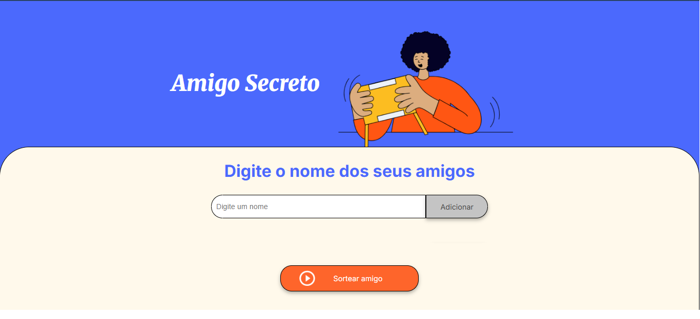

# Sorteador de Amigo

Este projeto implementa uma aplicação desenvolvida em JavaScript, HTML e CSS, que facilita a organização de sorteios entre amigos.

## Funcionalidades

- Adicionar participantes: permite adicionar quantos nomes o usuário quiser para a lista.

- Validação de entradas: impede que sejam inseridos nomes vazios ou duplicados.

- Atualização dinâmica: a lista é atualizada de maneira dinâmica conforme novos nomes são inseridos.

- Acessibildiade: são utilizados recursos de fala para orientar o usuário.

## Tecnologias

## Screenshots

## Status

